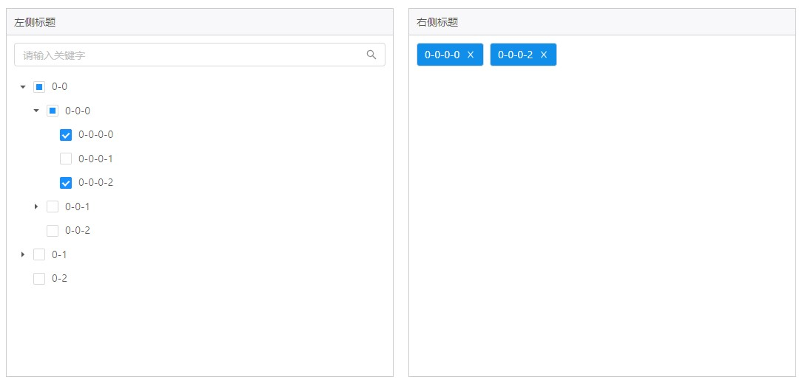

# 树选择器组件



基于 Antd 的 Tree 组件进行扩展以在业务中便捷使用。

## Demo

https://codesandbox.io/s/react-select-tree-demo-6wru0

## 安装

````
yarn add react-select-tree
````

## 使用

````
import React from 'react';
import SelectTree, { useSelectTree } from 'react-select-tree';
import 'react-select-tree/dist/react-select-tree.css';

const treeData: TreeNodeNormal[] = [
  {
    title: '0-0',
    key: '0-0',
    children: [
      {
        title: '0-0-0',
        key: '0-0-0',
        children: [
          { title: '0-0-0-0', key: '0-0-0-0' },
          { title: '0-0-0-1', key: '0-0-0-1' },
          { title: '0-0-0-2', key: '0-0-0-2' },
        ],
      },
      {
        title: '0-0-1',
        key: '0-0-1',
        children: [
          { title: '0-0-1-0', key: '0-0-1-0' },
          { title: '0-0-1-1', key: '0-0-1-1' },
          { title: '0-0-1-2', key: '0-0-1-2' },
        ],
      },
      {
        title: '0-0-2',
        key: '0-0-2',
      },
    ],
  },
  {
    title: '0-1',
    key: '0-1',
    children: [
      { title: '0-1-0-0', key: '0-1-0-0' },
      { title: '0-1-0-1', key: '0-1-0-1' },
      { title: '0-1-0-2', key: '0-1-0-2' },
    ],
  },
  {
    title: '0-2',
    key: '0-2',
  },
];

const App = () => {
  const treeState = useSelectTree({
    treeData,
    initialCheckedKeys: ['0-0-0-0', '0-0-0-2'],
    initialExpandedKeys: ['0-0', '0-0-0']
  });
  return (
    <div>
      <SelectTree leftTitle="左侧标题" rightTitle="右侧标题" placeholder="请输入关键字" treeData={treeData} {...treeState} />
    </div>
  );
};
````

## SelectTree 组件 Props

SelectTree 组件扩展 Antd 的 Tree 组件，具体属性请参考 Antd 的 Tree 组件文档。基本只包含 UI

属性 | 说明 | 类型 | 默认值
----|-----|------|------
| leftTitle    |  左侧标题  | string |  '标签目录'  |
| rightTitle    |  右侧标题  | string |  '标签名称'  |
| placeholder    |  搜索框占位符  | string |  'Search'  |
| prefix    |  类名前缀  | string |  'select-tree'  |
| onlyFilterItem | 是否是显示匹配搜索的项 | boolean | false |

## useSelectTree

自定义 hooks，抽离了大多数逻辑，返回：

````
{
    onExpand,
    onCheck,
    onSelect,
    expandedKeys,
    checkedKeys,
    selectedKeys,
    autoExpandParent,
    searchValue,
    onSearchChange,
    // 平级数据
    dataList,
}
````
